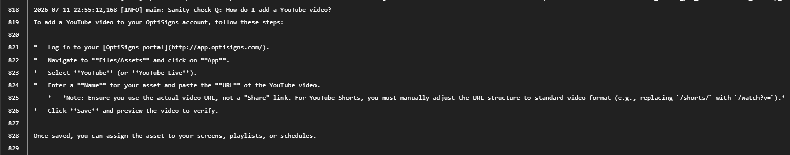

# MiniBotClone

## Setup

1. Install Docker.
2. Copy `.env.sample` to `.env` and fill in:
   ```
   GEMINI_API_KEY=<your Gemini API key>   # or pass API_KEY when running via docker run
   FILE_SEARCH_STORE_NAME=                # leave empty on first run; uploader.py creates it
   RUN_ONCE=false                         # true = run once and exit
   RUN_HOUR=17                            # scheduler hour (24h) for the daily job
   RUN_MINUTE=40                          # scheduler minute for the daily job
   ```
3. Build the image:
   ```
   docker build -t optibot .
   ```

## How to run locally

- **One-shot run** (scrape → upload delta → ask a sanity-check question, then exit 0 — `RUN_ONCE=true` by default in the image):
  ```
  docker run -e API_KEY=<your Gemini API key> optibot
  ```
- **Recurring scheduler** (scrape+upload daily at `RUN_HOUR:RUN_MINUTE`, no sanity check, runs forever) via `docker-compose.yml`,
  which sets `RUN_ONCE=false` and mounts `articles_md` so scraped content persists:
  ```
  API_KEY=<your Gemini API key> docker compose up
  ```
  Override the schedule by editing `RUN_HOUR`/`RUN_MINUTE` in `docker-compose.yml`, or pass
  `-e RUN_HOUR=9 -e RUN_MINUTE=0 -e RUN_ONCE=false` to `docker run`.

  The image sets `TZ=Asia/Ho_Chi_Minh` (UTC+7), so `RUN_HOUR=17` means 5 PM Vietnam time, not UTC.
  Override with `-e TZ=<your zone>` if you're scheduling from elsewhere.

### Chunking strategy

`uploader.py` uses Gemini's whitespace chunker: `max_tokens_per_chunk=200`, `max_overlap_tokens=20`.
Chunk counts are estimated client-side (~4 chars/token heuristic) and logged per file and per run.

### Delta detection

`scraper.py` hashes each article's rendered Markdown (SHA-256) and compares against `articles_md/manifest.json`
from the previous run to classify each article as added / updated / skipped. Only added/updated ids are written
to `articles_md/changed_ids.txt`, which `uploader.py` reads — so only the delta is re-embedded, and updated
articles have their old vector-store document deleted first to avoid duplicates.

## Job logs

All entry points (`scraper.py`, `uploader.py`, `job.py`, `main.py`) append timestamped logs to
[`job.log`](job.log) in the project root (also mirrored to stdout). Each run logs added/updated/skipped
counts, per-file upload results, and a final upload summary with the store's document counts.

## Sample question & answer

Prompt: **"How do I add a YouTube video?"**



*(screenshot placeholder — drop the actual capture at `docs/assistant-answer.png`)*
